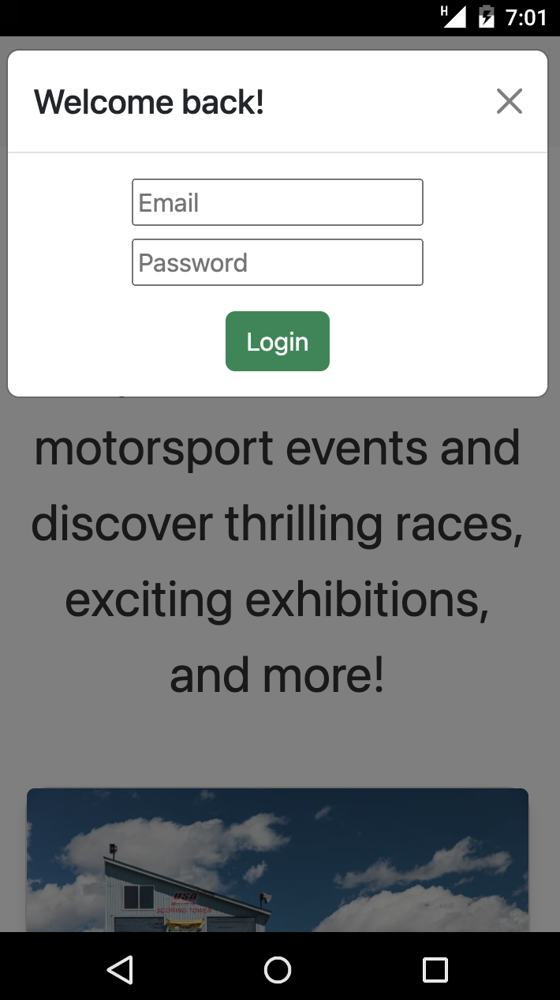
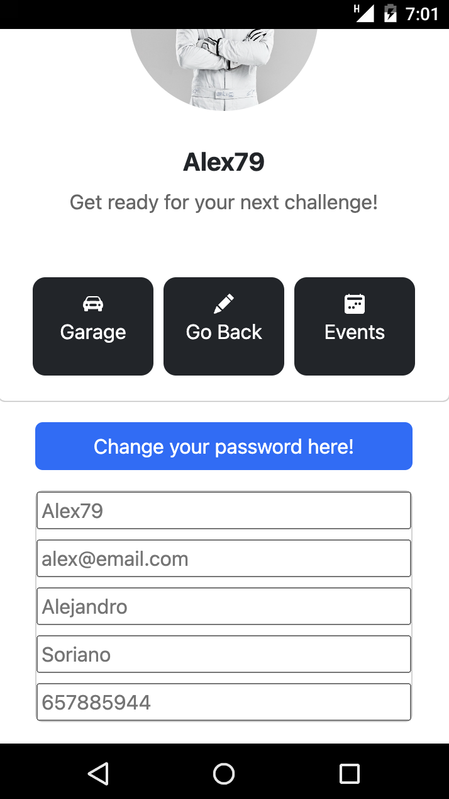
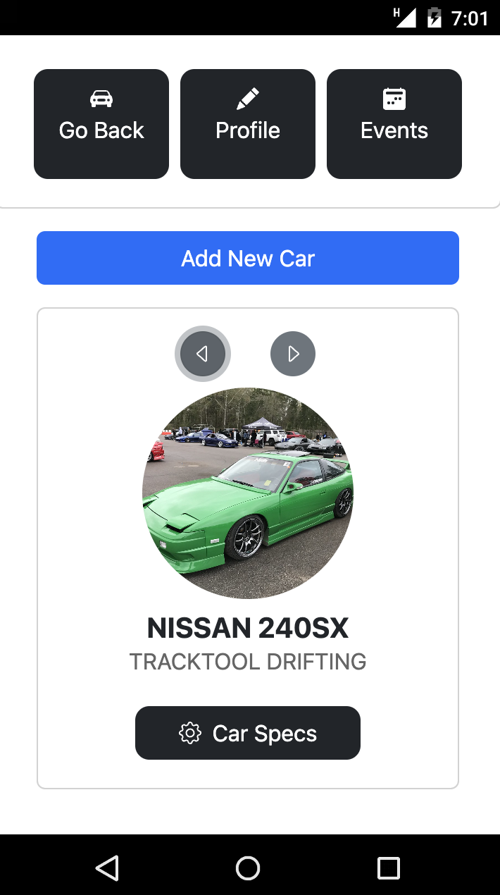
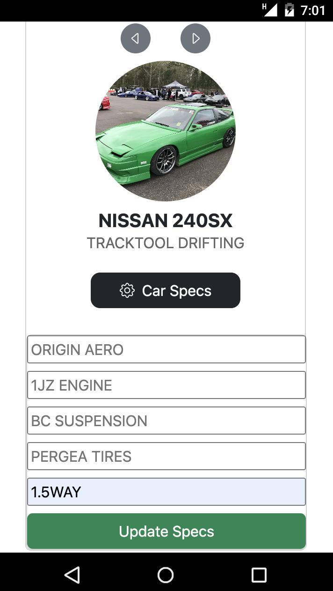
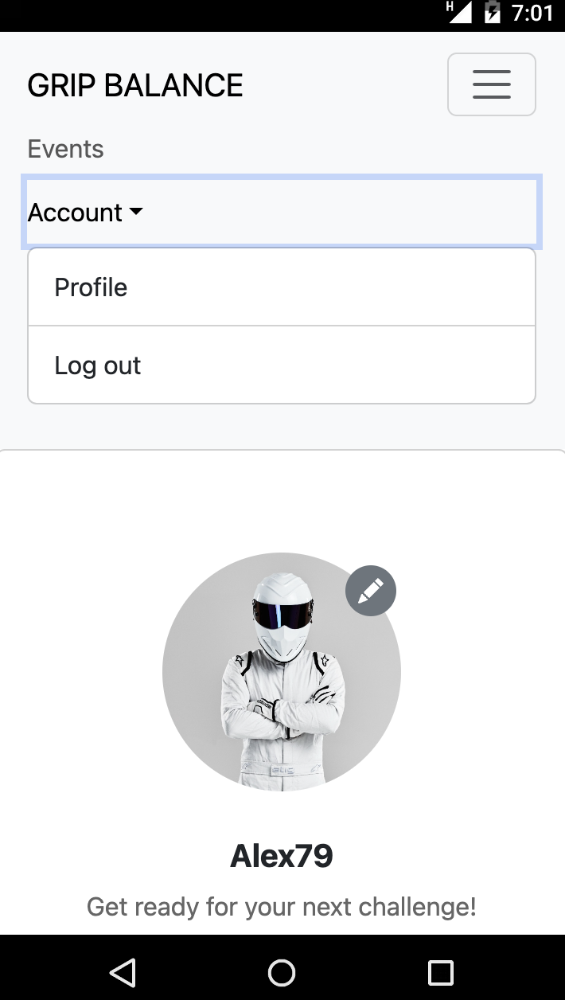
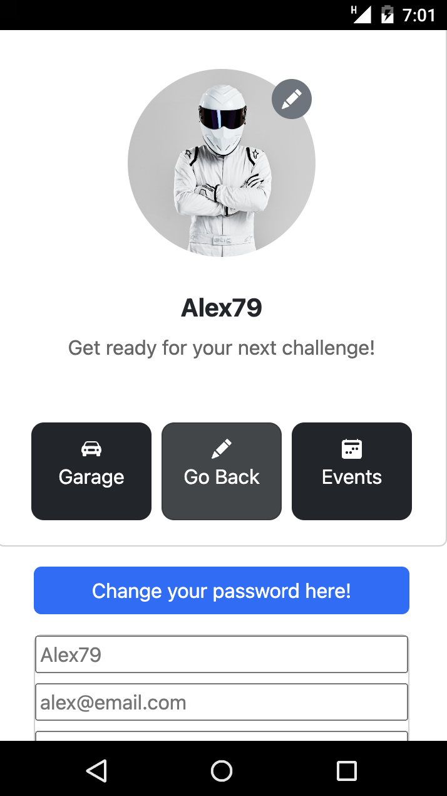
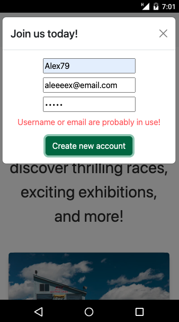

# Front APP REACT.JS GRIP BALANCE

<!-- <div align="center">
  
  
  
  
</div>

<div align="center">
  
  
  
  
  <h1>GRIP BALANCE</h1>
</div> -->

<div align="center">
  
  <h1>GRIP BALANCE</h1>
</div>

<details>
  <summary>Contenido 📝</summary>
  <ol>
    <li><a href="#objetivo">Objetivo</a></li>
    <li><a href="#sobre-el-proyecto">Sobre el proyecto</a></li>
    <li><a href="#stack">Stack</a></li>
    <li><a href="#funcionalidades">Funcionalidades</a></li>
    <li><a href="#instalación-en-local">Instalación</a></li>
    <li><a href="#futuras-funcionalidades">Futuras funcionalidades</a></li>
    <li><a href="#contribuciones">Contribuciones</a></li>
    <li><a href="#licencia">Licencia</a></li>
    <li><a href="#webgrafia">Webgrafia</a></li>
    <li><a href="#desarrollo">Desarrollo</a></li>
    <li><a href="#agradecimientos">Agradecimientos</a></li>
    <li><a href="#contacto">Contacto</a></li>
  </ol>
</details>


## Objetivo

Este proyecto está conectado a mi base de datos a través de la API Rest que hice anteriormente.
Link repositorio del backend: https://github.com/HSoriano99/BackendGripBalance

## Sobre el proyecto

Consiste en una aplicación web para eventos de motorsport. Contiene diferentes vistas, como Home donde encontrarás un breve resumen de los servicios que se ofrecen. Formulario de registro y login/logout desde el header, asi como navegar a la vista de eventos donde podremos visualizarlos y tener opción de inscribirnos en el caso de estar logueados. Vista de perfil de usuario donde tenemos un garaje virtual donde añadimos nuestros coches, incluimos caracteristicas tecnicas del vehiculo y las editamos para posteriormente inscribirse en los eventos en funcion de la compatibilidad con el evento. Como futuras funcionalidades podremos ver los inscritos en eventos pasados, ver sus coches y comparar sus caracteristicas o una vista como administrador con permisos únicos sobre usuarios y eventos.

## Stack

Tecnologías utilizadas:

- JAVASCRIPT
- REACT.JS
- REDUX
- REACT BOOTSTRAP
- SQL/MySQL
- EXPRESS
- DOCKER
- NODE.JS
- TYPESCRIPT
- TYPEORM

## Funcionalidades

  <div align="center">
    
    
    
  </div>


<details>
  <summary>Cliente 🙋🏽‍♂️</summary>
  <ol>
    <li>🔐 Registro / Login / Logout</li>
    <li>📝 Editar datos de perfil / Cambio de contraseña</li>
    <li>👀 Consultar su garaje</li>
    <li>🏎️ Añadir coches a su garaje</li>
    <li>🔩 Añadir o editar las características de cada coche</li>
  </ol>
  <div align="center">
    
    
    
    
  </div>
  <div align="center">
    
    
    
    
  </div>
</details>
<details>
  <summary> Gestión de errores ❌</summary>
  <div align="center">
    
    
    
    
  </div>
  
</details>

## Puesta en marcha

1. Clonar el repositorio
2. `$ npm install`
3. Conectamos nuestro repositorio con la base de datos
4. Iniciamos nuestra DB y nuestra API Rest
5. Iniciamos nuestro frontal
6. `$ npm run dev`
7. ...


## Futuras funcionalidades

[ ] Vista de admin, con permisos unicos sobre los eventos y los usuarios.
[ ] Método nuevo de cambio de imagen de perfil (en proceso)
[ ] Inscripciones a eventos en vista eventos y su muestra en sección eventos del perfil de los que estemos inscritos.

## Contribuciones

Las sugerencias y aportaciones son siempre bienvenidas.

Puedes hacerlo de dos maneras:

1. Abriendo una issue
2. Crea un fork del repositorio
   - Crea una nueva rama
     ```
     $ git checkout -b feature/nombreUsuario-mejora
     ```
   - Haz un commit con tus cambios
     ```
     $ git commit -m 'feat: mejora X cosa'
     ```
   - Haz push a la rama
     ```
     $ git push origin feature/nombreUsuario-mejora
     ```
   - Abre una solicitud de Pull Request

## Licencia

Este proyecto se encuentra bajo licencia de "Hector"

## Webgrafia:

Para conseguir mi objetivo he recopilado información de:

- Documentacion propia de React.js, React Bootstrap,...
- ...

## Desarrollo:

```js
const developer = "Hector";

console.log("Desarrollado por: " + developer);
```

## Agradecimientos:

Agradezco a mis compañeros el tiempo dedicado a este proyecto:

- **Erika**

- **Gabriel**

- **Reynaldo**


## Contacto

<a href = "hsoriano9986@gmail.com"></a>
